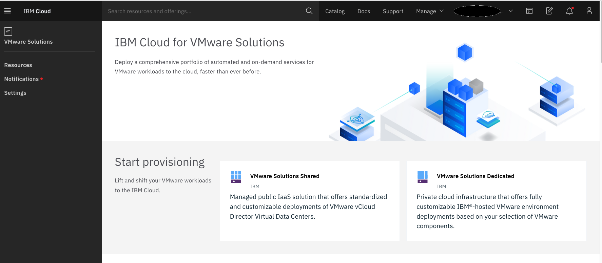

# Welcome VMware Solutions notebook

These are some tips and tricks I picked up while working on [VMware Solutions on IBM Cloud](https://cloud.ibm.com/infrastructure/vmware-solutions/console) offerings.

- Disclosure as always:
  - These are lessons learned, and we are just trying to share findings.
  - This is open source, so please don't hesitate to PR against this.
  - Comments are welcomed and we will do our best to acknowledge them

Table of Contents:
- [IBM Cloud](https://ibm.github.io/vmwaresolutions/ibmcloud/)
- [VMware vCloud Director](https://ibm.github.io/vmwaresolutions/vcd/)
- [Veeam Availability Suite](https://ibm.github.io/vmwaresolutions/vas/)
- [Veeam Cloud Connect Replication](https://ibm.github.io/vmwaresolutions/vccr/)
